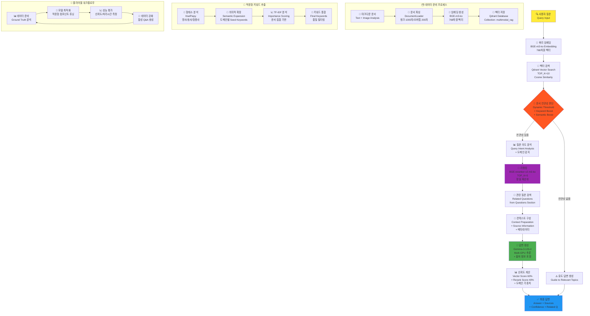
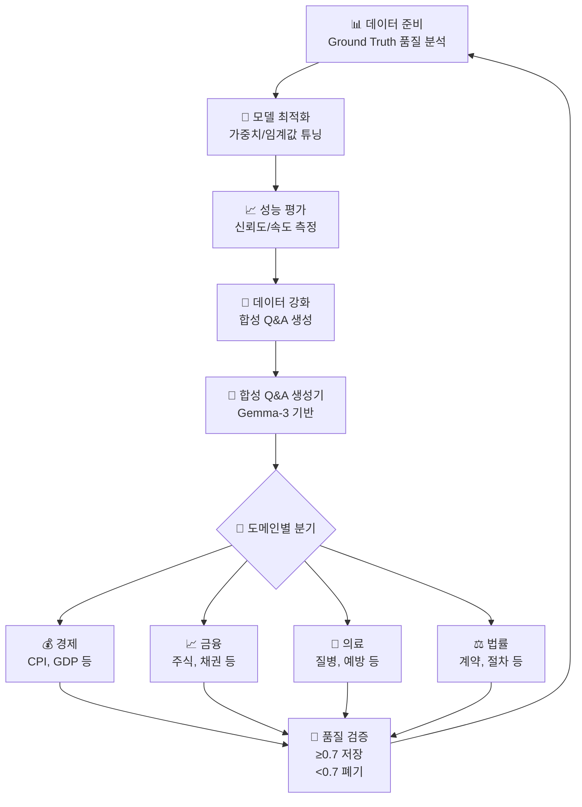

# multimodalrag

## 🔧 핵심 기술 스택
1. 임베딩 모델: dragonkue/BGE-m3-ko (한국어 특화, 768차원)
2. 리랭커: dragonkue/bge-reranker-v2-m3-ko
3. LLM: google/gemma-3-12b-it (답변 생성용)
4. 벡터 DB: Qdrant
5. NLP: KiwiPiepy (한국어 형태소 분석)
6. API: FastAPI (백엔드) + Streamlit (프론트엔드)

# Multi Modal RAG 워크플로우

# 합성데이터 워크플로우

## 합성데이터 생성 목적

1. 플라이휠 워크플로우의 핵심 동력
2. 도메인별 특화 Q&A 데이터 확보  
3. 모델 성능 지속적 개선
4. 데이터 부족 문제 해결

